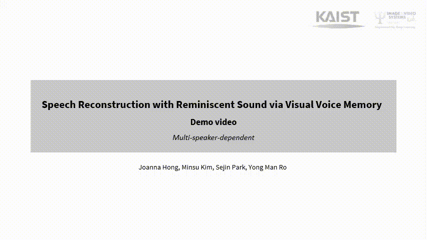

# Speech Reconstruction with Reminiscent Sound via Visual Voice Memory

## Overview
This repository contains the video demo and the audio samples of IEEE TASLP submitted paper titled "Speech Reconstruction with Reminiscent Sound via Visual Voice Memory"

## Demo video
Each demo video contains the original speech, the generated speech from previous work <a id="1">[1]</a>, and the generated speech from the proposed method from four different speakers. The video demos are also availalbe in [here](https://github.com/joannahong/VV-Memory/tree/main/demo-videos).
- Speaker-dependent [[Demo Video]](https://youtu.be/GkpSHjTc1RQ)
- Multi-speaker-dependent [[Demo Video]](https://youtu.be/nDpF9wpAGaE)
- Multi-speaker-independent [[Demo Video]](https://youtu.be/LG5NNwWe_pc)
<example>
 <p align="center">
  </p>

## Performances
The objective measurements of the test samples of each setting (speaker dependent, multi speaker dependent, multi speaker independent) are listed below. 
<div align="center">
 
|  | **STOI** | **ESTOI** | **PESQ** | 
| :---: | :---: | :---: | :---: | 
| **Speaker-dependent** (w/ griffin-lim) | 0.738 | 0.579 | 1.984 |
 | **Speaker-dependent** (w/ wavenet vocoder) | 0.737 | 0.578 | 1.984 |
| **Multi-speaker-dependent** | 0.754 | 0.602 | 2.112 |
| **Multi-speaker-independent** | 0.600 | 0.315 | 1.332 |
 
</div>

## Audio samples
The actual generated audio samples are available in [here](https://github.com/joannahong/VV-Memory/tree/main/audio-samples).

### Directory structure
The directory is composed with the following architecture
- `audio-samples/speaker-dependent`
    
    
    *The results on a single-speaker dependent setting on GRID*
    ```
    ├── s1_sgib9s (for example) : The results of Speaker 1 saying sgib9s (Set Green In B 9 Soon)
    |	├── ground_truth : ground truth audio
    |	├── lip2wav [1] : results of the previous state-of-the-art method[1] using Griffin-Lim
    |	├── ours_griffin_lim : results of the proposed method using Griffin-Lim
    |	├── ours_wavenet : results of the proposed method using WaveNet vocoder 
          (This is only for speaker-dependent setting to verify our proposed method works for other vocoder)
- `audio-samples/multi-speaker-dependent` 
    
    
    *The results on multi-speaker dependent setting on GRID*
    
    - same sub-folder architecture as the speaker-dependent
    - same architecture as speaker-dependent, except that we are not having audio from wavenet vocoder.
- `audio-samples/multi-speaker-independent`

    *The results on multi-speaker independent setting on GRID*
    
    - same sub-folder architecture as the speaker-dependent
    - same architecture as multi-speaker-dependent

----------
### GRID dataset dictionary
<div align="center">
 
| **Command** | **Color** | **Preposition** | **Letter** | **Digit** | **Adverb** |
| :---: | :---: | :---: | :---: | :---: | :---: |
| bin | blue | at |A-Z|0-9|again|
| lay | green | by | minus W | |now|
|place|red|in| | | please|
| set |white|with| | |soon|
 
</div>

## References
  <a id="1">[1]</a> K.Prajwal, R.Mukhopadhyay, V.P.Namboodiri, and C.Jawahar, “Learning individual speaking styles for accurate lip to speech synthesis,” in Proceedings of the IEEE/CVF Conference on Computer Vision and Pattern Recognition, 2020, pp.13 796–13 8
